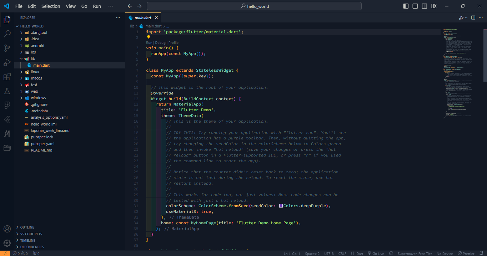
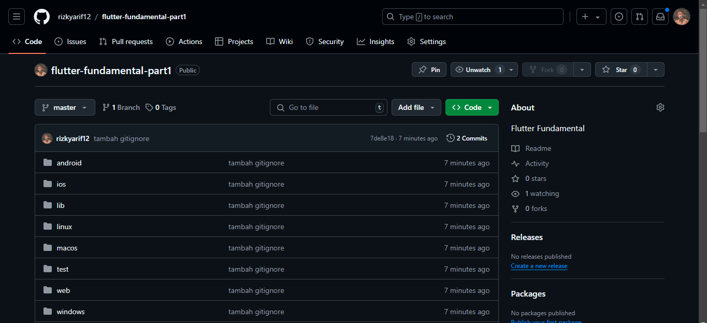
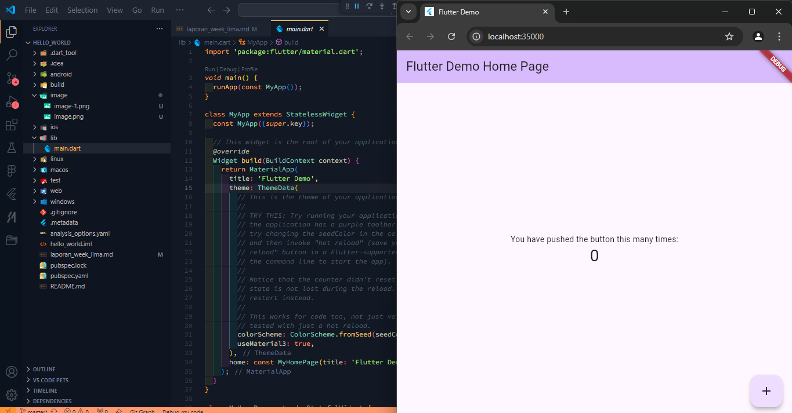
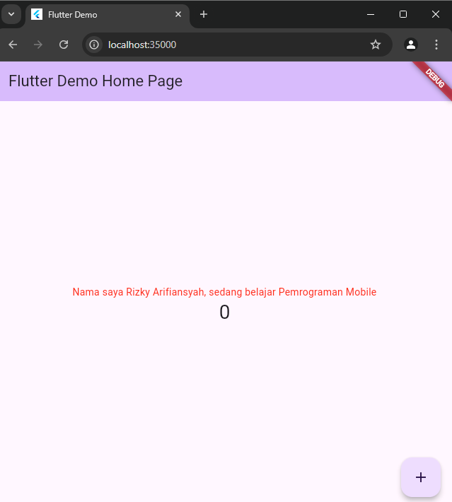
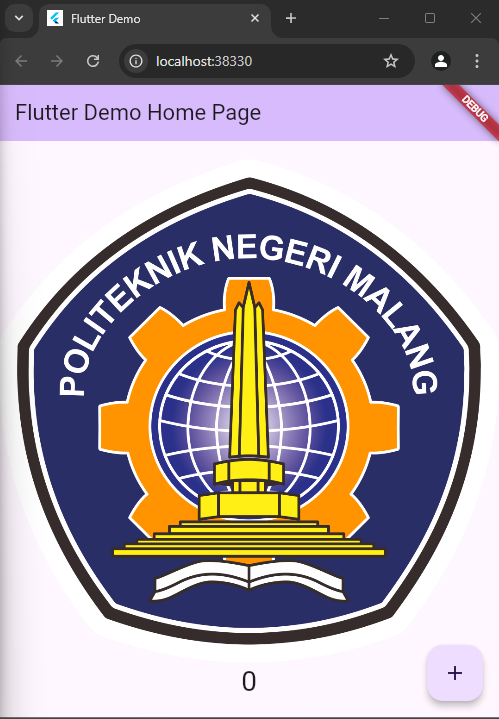

# Praktikum Week 5

Nama : Rizky Arifiansyah 
No : 24 
Kelas : TI-3B

## Praktikum 1 : Membuat Project Flutter Baru

## Praktikum 2 : Menghubungkan Perangkat Android atau Emulator

## Praktikum 3 : Membuat Repository GitHub dan Laporan Praktikum

Hasil Repo :

Hasil Debugg Flutter di Chrome :

## Praktikum 4 : Menerapkan Widget Dasar

Hasil Akhir Langkah 1:

Hasil Akhir Langkah 2 :

## Praktikum 5 : Menerapkan Widget Material Design dan iOS Cupertino
